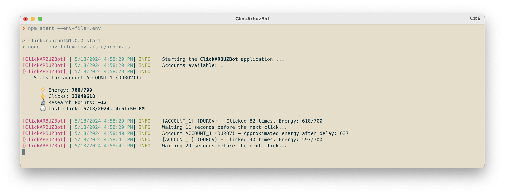

# ClickARBUZBot



## Description

Autoclicker script for ClickARBUZ. This script automates the process of clicking and energy management for multiple accounts.

## Installation

1. Clone the repository:
   ```bash
   git clone git@github.com:AlexMubarakshin/ClickARBUZBot.git
   ```
2. Navigate to the project directory:
   ```bash
   cd ./ClickARBUZBot
   ```
3. Install the dependencies:
   ```bash
   npm install
   ```
4. Create `.env` file
    ```bash
    cp ./.env.example ./.env
    ```

## Usage

1. Set up your `.env` file with your account information. Here's an example:
   ```
   ACCOUNT_1_TG_RAW_DATA="123456789:ABCDEFGH"
   ACCOUNT_1_USER_AGENT="Mozilla/5.0 (Windows NT 10.0; Win64; x64) AppleWebKit/537.36 (KHTML, like Gecko) Chrome/58.0.3029.110 Safari/537.3"

   PROCESS_STEP_DELAYS_IN_SECONDS="10,30"
   ```
2. Run the application:
   ```bash
   npm run start
   ```

## ❤️ Donate

`0x75aB5a3310B7A00ac4C82AC83e0A59538CA35fEE`
